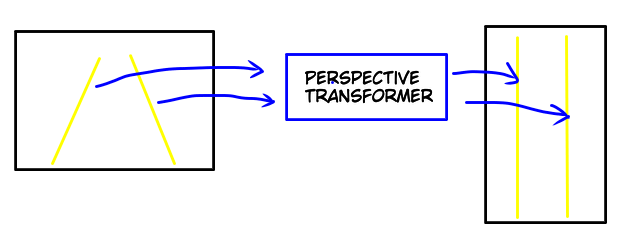
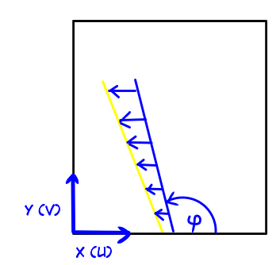
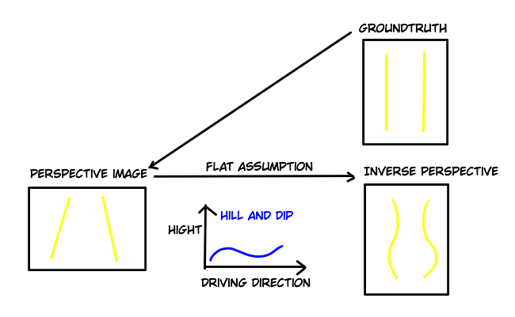
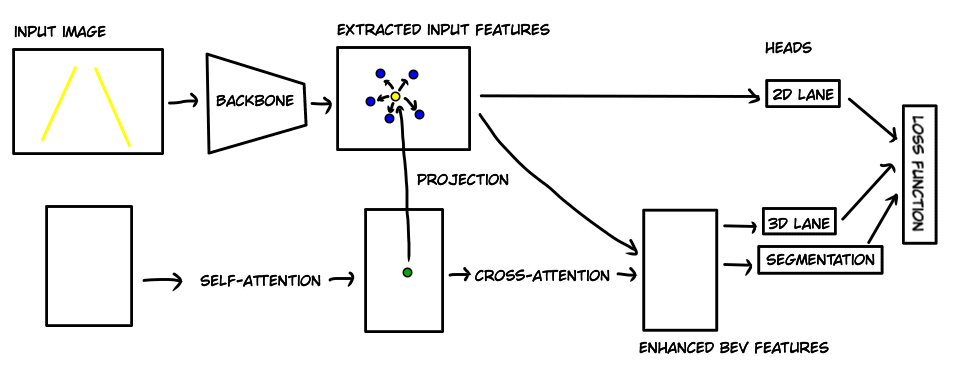

# PersFormer: 3D Lane Detection via Perspective Transformer and the OpenLane Benchmark 
[[arXiv](https://arxiv.org/abs/2203.11089), [github](https://github.com/OpenPerceptionX/PersFormer_3DLane), [dataset](https://github.com/OpenPerceptionX/OpenLane)]

- The paper proposes a 3D lane detector with a new Transformer-based front view to birds-eye-view transformation, called **Perspective Transformer** or **PersFormer** for short.\

- They have a unified 2D/3D anchor design. The anchors adopt the idea from classical object detection, to predict offsets from predefined line anchors as output.\

- They detect 2D and 3D lanes simultaneously.
- Furthermore, they publish a new dataset called [OpenLane](https://github.com/OpenPerceptionX/OpenLane), which contains 200.000 frames, over 880.000 instance-level lanes, 14 lane
categories, along with scene tags and the closed-in-path object annotations
- In an autonomous driving stack, the planning and control modules often require the input data to be in birds-eye-view format.
- Conventional methods detect the lanes in the perspective view and then reproject the detected lanes via inverse perspective mapping (IPM) to birds-eye-view. For the projection, they assume that the ground is flat. This does not hold in cases of hills and dips, bumps and crush turns.\

- They use the [deformable attention mechanism](https://arxiv.org/abs/2010.04159) which remarkably reduces the computational memory requirement.\
\
A target point (yellow) attends only to a couple of source points instead of all source points

## Architecture
- The overall structure consists of a backbone, the Perspective Transformer and post-processing.\

- The **backbone** extracts multi-scale features from a monocular front camera image using an [EfficientNet](https://arxiv.org/abs/1905.11946), which is a popular Resnet variant.
- These front view features might suffer from the defect of scale variance and occlusion. Instead of a simple 1-to-1 projection, the **Perspective Transformer** attends to local context and aggregates surrounding features.
- Finally, the **lane detection heads** predict 2D and 3D coordinates and lane types.
- The 2D head uses [LaneATT](https://arxiv.org/abs/2010.12035) and the 3D head [3D-LaneNet](https://arxiv.org/abs/1811.10203) with some modifications.
- Inspired by [Detection Transformer(DETR)](https://arxiv.org/abs/2005.12872), the Perspective Transformer consists of the self-attention module and cross-attention module
- In the **self-attention module** the network learns which points in the birds-eye-view are related.
- In the **cross-attention module**, the network learns to which parts in the birds-eye-view are related to which parts of the input features.
- A standard Transformer cannot be applied because of the high computational cost. Inspired by [Deformable DETR](https://arxiv.org/abs/2010.04159) a **deformable transformer** is used, which learns to attend to a couple of most related reference points in the perspective features.
- To determine the location of the reference points, a target point from birds-eye-view is first projected with a pinhole projection matrix to the corresponding point in the perspective image features, then offsets from the projected point to a certain number of surrounding reference points are learned.
- Lastly, the features of the reference points are used to determine the value of the corresponding target point.
- The **lane detection** uses an **anchor based method**.
- Since [LaneATT](https://arxiv.org/abs/2010.12035) uses too many anchors and [3D-LaneNet](https://arxiv.org/abs/1811.10203) too few and only parallel anchors, they do an anchor redesign. 
- Their new anchors work in **2D and 3D**. With that, they benefit from **co-learning**.
- They use line anchors with certain incline angles.
- To describe the lane shape, they learn x-offsets at pre-determined y-positions, similar to anchor regression in object detection tasks.
- Additionally, they learn the visibility of a point.
- In the 3D case, they also learn the height of the point.
- As **loss**, they use the sum of all losses of all anchors, both in 2D and 3D. 
- To increase the performance, they add a **segmentation head** and add a segmentation loss to the anchor losses.

