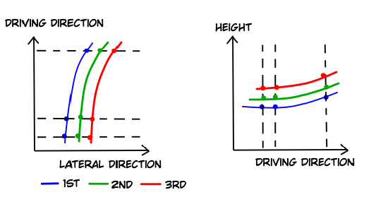
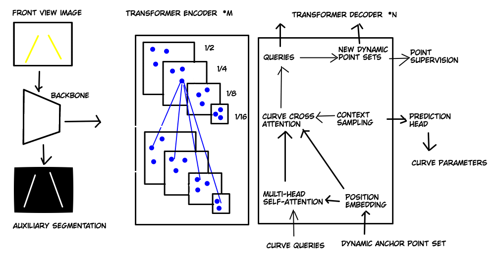

# CurveFormer 3D Lane Detection by Curve Propagation with Curve Queries and Attention
[[arXiv](https://arxiv.org/abs/2209.07989)]

# Key ideas
- **Transformer-based method for 3D lane detection**
- **Lanes** are represented by two polynomials (top view and side view), start and end points and lane confidence.

- estimates the lanes directly **without an intermediate 3D representation of the scene**
- inspired by [DAB-DETR (Dynamic Anchor Box DETR)](https://arxiv.org/abs/2201.12329)
- uses a **set of 3D anchor points** that is **iteratively refined** in the layers of the cross-attention module

- predicted curves and groundtruth curves are associated by bipartite matching (Hungarian algorithm).

# Description
- Introduces **Curve-Former**, a Transformer-based method for **3D lane detection**.
- **Lanes** are represented by two polynomials (top view and side view), start and end points and lane confidence.
- A **set of 3D dynamic anchor points** is used to attend to corresponding image features. 
- Since the 3D anchor points (x; y; z) have height information, camera extrinsic parameters can be used to obtain accurate image features corresponding to the point.
- The dynamic **anchor point set is iteratively refined** within the sequence of Transformer decoders
- A novel curve **cross-attention module in the decoder** is introduced, that uses a **context sampling unit** to predict offsets from the combination of reference features and curve queries to guide sampling offsets learning. 
- In addition, an **auxiliary segmentation branch** is used to enhance the shared CNN backbone.

- CurveFormer consists of 4 main components:
  1. **CNN Backbone:**\
  Takes a single front-view image as input and outputs multiscale feature maps.
  1. **Transformer encoder:**\
  Enhances the multi-scale feature maps.
  1. **Curve Transformer decoder**:\
  Propagates curve queries by curve cross-attention and iteratively refines anchor point sets.
  1. **Prediction head:**\
  Outputs 3D lane parameters.
- The predicted parameters for each lane are:\
confidence, start and stop in y direction and two polynomials, one for the top view x-y and one for the side view y-z.
- In the Transformer Encoder, each scale feature map can **exchange information with other feature maps of different scales** with the help of a **deformable self-attention** module.
- In the decoder, the **queries** used in the Transformer-based 3D lane detection are **sets of dynamic anchor points** which are sampled at a set of fixed Y locations.
- The curve query is **refined layer-by-layer** in the Transformer decoder. Each Transformer decoder estimates relative positions.
- The **Curve Transformer decoder** contains a **multi-head self-attention module**, a **context sampling module** and a **curve cross-attention module**.
- [Deformable attention](https://arxiv.org/abs/2010.04159) is applied in the self-attention module.
- The **context sampling module** predicts sampling offsets by incorporating more relative image features. First, the anchor point sets are projected to the image view with camera parameters. Then bilinear interpolation is used to extract features from these projected points on the multiscale feature maps X. 
- **Curve Training**:
  - The predicted curves and groundtruth curves are associated by bipartite matching (Hungarian algorithm). A set of 3D points is sampled from the curve to compute the matching and training loss.
  - The **final training** loss can be written as L_total = L_curve + L_query + L_seg, where L_curve is the curve prediction loss, L_query is the deep supervision of refined anchor point set for each curve, and L_seg is an auxiliary segmentation loss.
