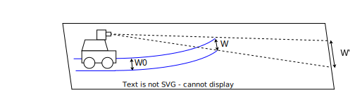
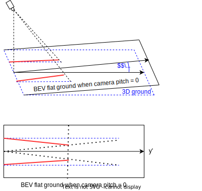
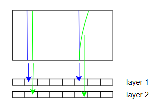

# WS-3D-Lane Weakly Supervised 3D Lane Detection With 2D Lane Labels

## Key points
- introduces **weakly supervised** 3D lane line detection called WS-3D-Lane.
- the weakly supervision **uses 2D lane line labels** to train 3D lane lines
- uses the assumption of **constant lane width** and **equal height** of adjacent lane lines to **derive the height of points** on the lane lines.
- uses a **camera pitch estimation**
- has improved anchors with **2 anchors at the same lateral position**, so that close lane lines can be detected

## Details
- Because generating 3D groundtruth is difficult and prone to errors, they use **2D groundtruth**, that is more available and is assumed to have better quality.
- They use the assumption of **constant lane width** and **equal height** of adjacent lane lines to **derive the height of points** on the lane lines.
- Uses [3D-LaneNet](https://arxiv.org/abs/1811.10203) as basic network.
- The method first **converts the 2D lane line groundtruth to a flat birds-eye-view** with **camera pitch** and camera height, then uses the converted groundtruth and their assumptions to supervise the training.
- When the 3D lane line is not flat, the lane width on the BEV flat ground at far positions changes. It tends to be wider when the front road is uphill and narrower when the front road is downhill.\

- To estimate the **camera pitch** (camera pitch self-calibration), they first determine the gradients of lines projected on a flat ground with camera pitch = 0 (red lines in the bottom image). Then, with the help of the pinhole model, they derive the camera pitch angle theta from the difference of these gradients.\

- They use **2 anchors at the same lateral position** (double-layer anchor). The first anchor in layer 1 predicts the left line of the two close lane lines, while the second layer anchors predict the right. The constant lane width assumption is not used for anchors at the same lateral position, to avoid issues with forks and curbs.\

- To avoid multiple anchors predicting the same lane line, they use non-maximum suppression (NMS).
- Additionally, they use **pitch augmentation** (from [GeoStructurePrior](https://arxiv.org/abs/2206.10098)) and a **BEV segmenation branch** (from [PersFormer](https://arxiv.org/abs/2203.11089))
- Their full **loss with weak supervision** is: 
L_ws = L_bev + L_width + L_height + L_seg + L_pitch
- L_bev is similar to the loss of [Gen-LaneNet](https://arxiv.org/abs/2003.10656)
- The loss function in a **supervised setting** is: 
L_sup = L_bev + L_z + L_seg+ L_pitch