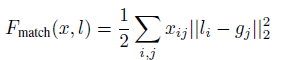
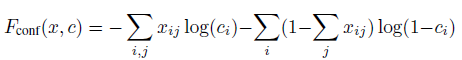
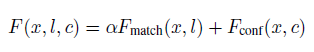
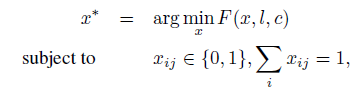

# Scalable Object Detection using Deep Neural Networks (Google)
## Abstract
- proposes a neural network model for detection, which predicts a set of class-agnostic bounding boxes along with a single score for each box, corresponding to its likelihood of containing any object of interest. 
- The model naturally handles a variable
number of instances for each class.
## Introduction
- Classical approches used to train object detectors which operate on a subimage and apply these detectors in an exhaustive manner across all locations and scales.
- The exhaustive search through all possible locations and
scales poses a computational challenge
- as solution to this is to use segmentation
to suggest a small number of object hypotheses
- they propose a detector, called “DeepMultiBox”,’ which
generates a few bounding boxes as object candidates. These
boxes are generated by a single DNN in a class-agnostic
manner. 
- The model has several contributions. 
  - First, they define object detection as a regression problem to the coordinates of several bounding boxes. 
  - In addition, for each predicted box the net outputs a confidence score of how likely this box contains an object
- The second major contribution is the loss, which trains
the bounding box predictors as part of the network training. For each training example, they solve an assignment problem between the current predictions and the groundtruth boxes and update the matched box coordinates, their confidences and the underlying features through Backpropagation
- Finally, they train the object box predictor in a class-agnostic manner. they consider this as a scalable way to enable efficient detection of large number of object classes
- they show that the box predictor generalizes over unseen
classes
## Proposed approach
They aim at achieving a class-agnostic scalable object detection by predicting a set of bounding boxes, which represent potential objects. More precisely, they use a Deep Neural Network (DNN), which outputs a fixed number of
bounding boxes. In addition, it outputs a score for each box expressing the networks confidence of this box containing an object.

### Model 
To formalize the above idea, they encode the i-th
object box and its associated confidence as node values of
the last net layer

### Bounding box
They encode the upper-left and lower-right coordinates of each box as four node values, which can be written as a vector li from R4. These coordinates are normalized w. r. t. image dimensions to achieve invariance to absolute image size. Each normalized coordinate is produced by a linear transformation of the last
hidden layer.
### Confidence: 
the confidence score for the box containing an object is encoded as a single node value ci from [0, 1].
This value is produced through a linear transformation
of the last hidden layer followed by a sigmoid.

They use the confidence scores and non-maximum suppression to obtain a smaller number of high-confidence boxes at inference time. These boxes are supposed to represent objects. As such, they can be classified with a subsequent classifier to achieve object detection.

### Training Objective
They train a DNN to predict bounding boxes and their confidence scores for each training image such that the highest scoring boxes match well the groundtruth object boxes for the image. 

Suppose that for a particular training example M objects were labeled by bounding boxes gj , j from  [1...M]. In practice, the number of predictions K is much larger than the number of groundtruth boxes M. Therefore, they try to optimize only the subset of predicted boxes which match best the ground truth ones. They optimize their locations to improve their match and maximize their confidences. At the same time they minimize the confidences of the remaining predictions, which are deemed not to localize the true objects well.
To achieve the above, they formulate an assignment problem
for each training example. They denote the assignment: xij = 1 iff the i-th prediction is assigned to j-th true object. The objective of this assignment can be
expressed as:

    
Additionally, they want to optimize the confidences of the
boxes according to the assignment x. Maximizing the confidences of assigned predictions can be expressed as:

In the above objective sum_j(xij) = 1 iff prediction i has been matched to a groundtruth. In that case ci is being maximized, while in the opposite case it is being minimized.

The final loss objective combines the matching and confidence losses:

### Optimization:

 For each training example, they solve for an
optimal assignment x* of predictions to true boxes by

where the constraints enforce an assignment solution. This
is a variant of bipartite matching.
Then, they optimize the network parameters via back
propagation

### Modifications
- perform clustering of ground truth locations and find K such clusters/centroids that they can use as priors for each of the predicted locations. Thus, the learning algorithm is encouraged to learn a residual to a prior, for each of the predicted locations
- using these priors in the matching process: instead of matching the N ground truth locations with the K predictions, they find the best match between the K priors and the ground truth. Once the matching is done, the target confidences are computed as before. They call the usage of priors for matching prior matching and hypothesize that it enforces diversification among the predictions

Although they defined the method in a class-agnostic way, they can apply it to predicting object boxes for a particular class. To do this, they simply need to
train the models on bounding boxes for that class