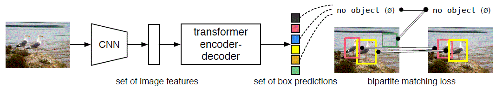
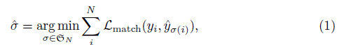
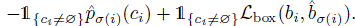
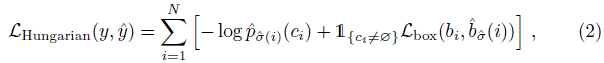
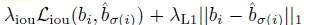
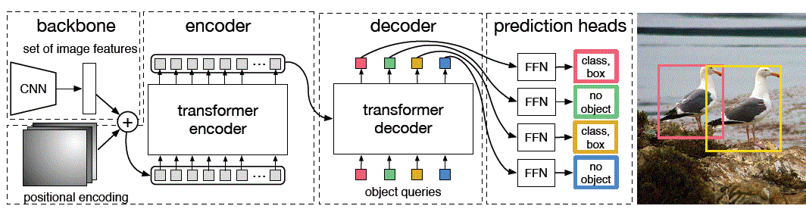

# 2020 - End-to-End Object Detection with Transformers (Facebook AI)
[arxiv](https://arxiv.org/abs/2005.12872),
[code](https://github.com/facebookresearch/detr)

## Abstract
- views object detection as a **direct set prediction problem**
- is **removing** the need for many **hand-designed components like a non-maximum suppression** procedure or **anchor generation**
- framework called **DEtection TRansformer** or **DETR**
  - **set-based global loss** that forces unique predictions via **bipartite
matching**
  - **transformer encoder-decoder** architecture
- Given a **fixed small set of learned object queries**, DETR **reasons about the relations of the objects and the global image context** to **directly output the final set of predictions in parallel**
- conceptually simple and **does not require a specialized library**
- accuracy and run-time performance **on par with** the well-established and highly-optimized **Faster R-CNN** baseline

## Introduction
- The goal of object detection is to predict a set of bounding boxes and category labels for each object of interest. 
- Modern detectors address this set prediction task in an indirect way, by defining surrogate regression and classifcation problems on a large set of proposals, anchors, or window centers. Their performances are signifcantly influenced by postprocessing steps to collapse near-duplicate predictions, by the design of the anchor sets and by the heuristics that assign target boxes to anchors. 
- To simplify these pipelines, we propose a **direct set prediction approach** to **bypass the surrogate tasks**. 
- **end-to-end philosophy**
- **encoder-decoder architecture based on tranformers**
- The **self-attention mechanisms** of transformers, which explicitly **model all pairwise interactions between elements in a sequence**, make these architectures particularly **suitable for constraints of set prediction such as removing duplicate predictions**
- the DEtection TRansformer (DETR) **predicts all objects at
once**, and is **trained end-to-end with a set loss function which performs bipartite matching between predicted and ground-truth objects**
- is dropping multiple hand-designed components that encode
prior knowledge, like spatial anchors or non-maximal suppression
- doesn't require any customized layers
- the main features of DETR are the **conjunction of the bipartite matching loss and transformers with
(non-autoregressive) parallel decoding**
- significantly better performance on large objects, likely enabled by the
non-local computations of the transformer
- lower perforamances on small objects
- requires extra-long training schedule and auxiliary decoding losses

DETR directly predicts (in parallel) the final set of detections by **combining a common CNN with a transformer architecture**. During training, bipartite matching uniquely assigns predictions with ground truth boxes. **Prediction with no match** should yield a "**no object**" class prediction.

## Related work
### Set prediction
The first dificulty in set prediction is to avoid near-duplicates. Most current detectors use postprocessings such as non-maximal suppression to address this issue, but direct set prediction are postprocessing-free. They need global inference schemes that **model interactions between all predicted elements to avoid redundancy**
### Transformers and parallel decoding
Transformers were first used in auto-regressive models, following early sequence-to-sequence models, generating output tokens one by one. However, the prohibitive inference cost (proportional to output length, and hard to batch) lead to the development of **parallel sequence generation**
### Object detection
- Most modern object detection methods make predictions relative to some initial guesses. **Two-stage detectors predict boxes w.r.t. proposals**, whereas
**single-stage methods make predictions w.r.t. anchors or a grid of possible object centers**
- our model is able to remove this hand-crafted process and streamline the detection process by directly predicting the set of detections with **absolute box prediction w.r.t. the input image** rather than an anchor

## The DETR model
Two ingredients are essential for direct set predictions in detection: 
- (1) a **set prediction loss** that **forces unique matching between predicted and ground truth boxes** 
- (2) an **architecture that predicts (in a single pass) a set of objects and models their relation**

### Object detection set prediction loss
- DETR infers a **fixed-size set of N predictions**, in a **single pass** through the decoder, where N is set to be signifcantly larger than the typical number of objects in an image. 
- One of the main diffculties of training is to score predicted objects (class, position, size) with respect to the ground truth. **Our loss produces an optimal bipartite matching between predicted and ground truth objects, and then optimize object-specific (bounding box) losses**
- denote by y the ground truth set of objects, and ^y the set of N predictions. Assuming N is larger than the number of objects in the
image, we consider y also as a set of size N padded with (no object). 
- To find a bipartite matching between these two sets we search for a permutation of N elements sigma with the lowest cost:

- where **Lmatch is a pair-wise matching cost** between ground truth yi and a prediction with index sigma(i). This **optimal assignment is computed effciently** with the **Hungarian algorithm**
- The **matching cost takes into account both the class prediction and the similarity of predicted and ground truth boxes**. Each element i of the ground truth set can be seen as a yi = (ci; bi) where ci is the target class label (which may be empty) and bi from [0,1] is a vector that defines ground truth box center
coordinates and its height and width relative to the image size
- definition Lmatch

- The **second step** is to **compute the loss function**, the **Hungarian loss for all pairs matched in the previous step**. We define the loss similarly to the losses of common object detectors, i.e. a **linear combination of a negative log-likelihood for class prediction and a box loss** defined later 

where **sigma^ is the optimal assignment computed in the first step** (1).
- we **down-weight the log-probability term when ci = no object by a factor 10 to account for class imbalance**. This is analogous to how Faster R-CNN training procedure balances positive/negative proposals by subsampling
- In the matching cost we use probabilities instead of log-probabilities. This makes the class prediction term commensurable to Lbox
- **Bounding box loss**: The second part of the matching cost and the Hungarian loss is Lbox that scores the bounding boxes. Unlike many detectors that do box predictions as a delta w.r.t. some initial guesses, we make box predictions directly.
While such approach simplify the implementation, it poses an issue with relative scaling of the loss. The most commonly-used **l1 loss will have different scales for small and large boxes** even if their relative errors are similar. To mitigate this
issue we use a **linear combination of the l1 loss and the generalized IoU loss Liou that is scale-invariant**. Overall, our box loss Lbox is defined as

  These two losses are **normalized by the number of objects inside the batch**

### DETR architecture

DETR uses a conventional CNN backbone to learn a 2D representation of an input image. The model flattens it and supplements it with a positional encoding before passing it into a transformer encoder. A transformer decoder then takes as input a small fixed number of learned positional embeddings, which we call object queries, and additionally attends to the encoder output. We pass each output embedding of the decoder to a shared feed forward network (FFN) that predicts either a detection (class and bounding box) or a "no object" class.

- **three main components**: a CNN backbone to extract a compact feature representation, an encoder-decoder transformer, and a simple feed forward network (FFN) that makes the final detection prediction
- **Inference code for DETR can be implemented in less than 50 lines in PyTorch**

- **Backbone**: Starting from the initial image ximg 3xH0xW0 (with 3 color channels), a conventional CNN backbone generates a lower-resolution activation
map f CxHxW. Typical values we use are C = 2048 and H,W = H0/32 , W0/32.

- **Transformer encoder**: First, a **1x1 convolution reduces the channel dimension of the high-level activation map f** from C to a smaller dimension d. creating a **new feature map z0** dxHxW. The encoder expects a sequence as input, hence we **collapse the spatial dimensions of z0 into one dimension**, resulting in a dxHW feature map. **Each encoder layer** has a standard architecture and consists of a **multi-head self-attention module and a feed forward network (FFN)**. Since the transformer architecture is permutation-invariant, we supplement it with **fixed positional encodings that are added to the input of each attention layer**.

- **Transformer decoder**: The decoder follows the **standard architecture of the transformer**, transforming N embeddings of size d using multi-headed self- and encoder-decoder attention mechanisms. The **difference with the original transformer**
is that **our model decodes the N objects in parallel** at each decoder layer, while Vaswani et al. use an autoregressive model that predicts the output sequence one element at a time. Since the decoder is also permutation-invariant, **the N input embeddings must be different to produce different results**. These input embeddings are **learned positional encodings that we refer to as object queries**, and similarly to the encoder, we **add them to the input of each attention layer**.
The N object queries are transformed into an output embedding by the decoder.
They are then **independently decoded into box coordinates and class labels by a feed forward network**, resulting N final
predictions. **Using self- and encoder-decoder attention over these embeddings, the model globally reasons about all objects together using pair-wise relations between them, while being able to use the whole image as context**.

- **Prediction feed-forward networks (FFNs)**: The final prediction is computed by a 3-layer perceptron with ReLU activation function and hidden dimension d, and a linear projection layer. The **FFN predicts the normalized center coordinates, height and width of the box w.r.t. the input image**, and the **linear layer predicts the class label using a softmax function**. Since we predict a fixed-size set of N bounding boxes, where N is usually much larger than the actual number of objects of interest in an image, an **additional special class label "no object"** is used to represent that **no object is detected within a slot**. This class plays a similar role to the "background" class in the standard object detection
approaches.

- **Auxiliary decoding losses**: We found helpful to use auxiliary losses in decoder during training, especially to help the model output the correct number of objects of each class. We add prediction FFNs and Hungarian loss after each decoder layer. All predictions FFNs share their parameters. We use an additional
shared layer-norm to normalize the input to the prediction FFNs from different decoder layers.

## Experiments
- All transformer weights are initialized with Xavier init, and the backbone is with ImageNet-pretrained ResNet model with frozen
batchnorm layers
- Transformers are typically trained with Adam or Adagrad optimizers with very long training schedules and dropout