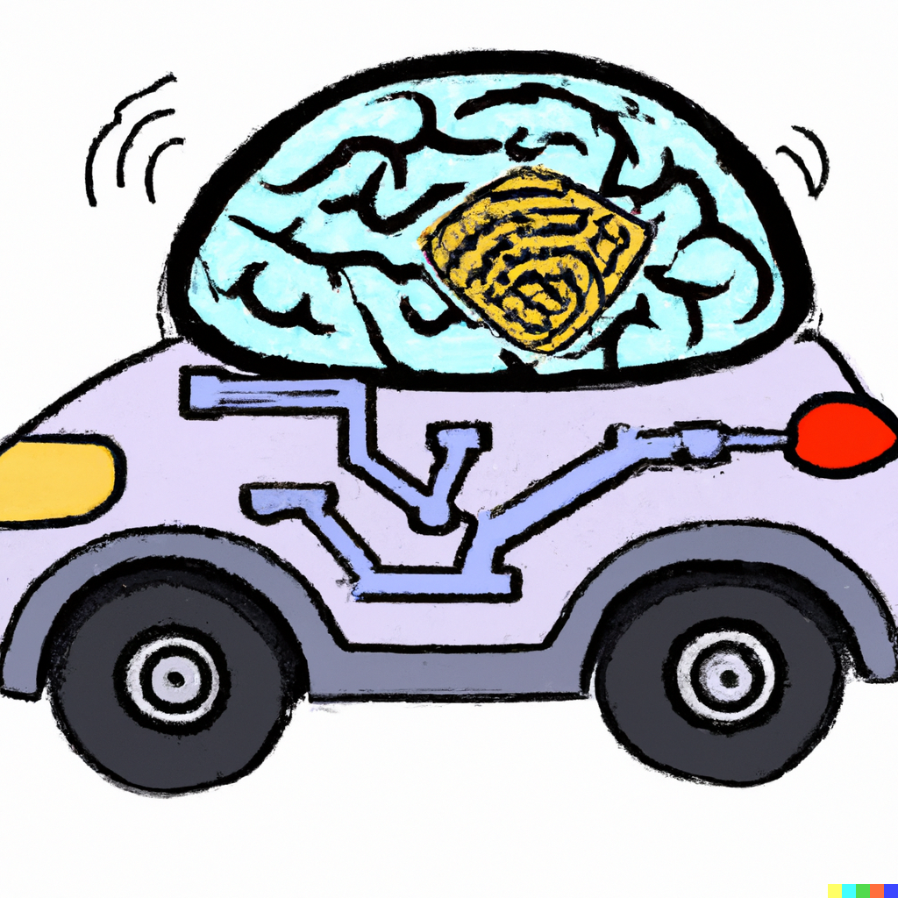

(image made by [DALL·E 2](https://openai.com/dall-e-2))

# A collection of machine learning lane detection papers

- [2022 - CurveFormer 3D Lane Detection by Curve Propagation with Curve Queries and Attention](Lane-Detection/2022%20-%20CurveFormer%203D%20Lane%20Detection%20by%20Curve%20Propagation%20with%20Curve%20Queries%20and%20Attention/2022%20-%20CurveFormer%203D%20Lane%20Detection%20by%20Curve%20Propagation%20with%20Curve%20Queries%20and%20Attention.md)
- [2022 - ONCE-3DLanes - Building Monocular 3D Lane Detection](Lane-Detection/2022%20-%20ONCE-3DLanes%20-%20Building%20Monocular%203D%20Lane%20Detection/2022%20-%20ONCE-3DLanes%20-%20Building%20Monocular%203D%20Lane%20Detection.md)
- [2022 - PersFormer 3D Lane Detection via Perspective Transformer and the OpenLane Benchmark](Lane-Detection/2022%20-%20PersFormer%203D%20Lane%20Detection%20via%20Perspective%20Transformer%20and%20the%20OpenLane%20Benchmark%20-%20Chen/2022%20-%20PersFormer%203D%20Lane%20Detection%20via%20Perspective%20Transformer%20and%20the%20OpenLane%20Benchmark%20-%20Chen.md)
- [2022 - WS-3D-Lane Weakly Supervised 3D Lane Detection With 2D Lane Labels](Lane-Detection/2022%20-%20WS-3D-Lane%20Weakly%20Supervised%203D%20Lane%20Detection%20With%202D%20Lane%20Labels/2022%20-%20WS-3D-Lane%20Weakly%20Supervised%203D%20Lane%20Detection%20With%202D%20Lane%20Labels.md)
