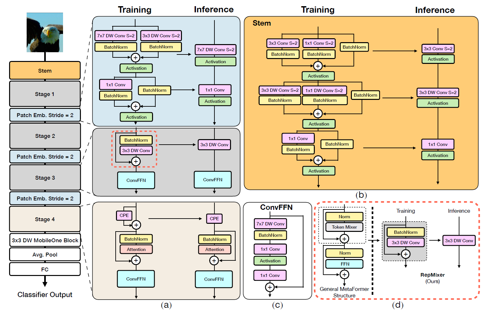

# 2023 - FastViT: A Fast Hybrid Vision Transformer using Structural Reparameterization
[arxiv](https://arxiv.org/abs/2303.14189)

## Abstract
- introduces **FastViT**, a hybrid vision transformer architecture that obtains the state-of-the-art **latency-accuracy trade-off**
- introduces a **novel token mixing operator**, **RepMixer**, that uses structural reparameterization to lower the memory access cost by **removing skip-connections** in the network. 
- We further apply **traintime overparametrization** and **large kernel convolutions**
- 4.9× faster than EfficientNet
- highly **robust to out-of-distribution samples and corruptions**

## Introduction
- Recent **hybrid architectures combine the strengths of convolutional architectures and transformers**
- Recent vision and hybrid transformer models follow the **[Metaformer](https://arxiv.org/abs/2111.11418) architecture**, which consists
of a token mixer with a skip connection followed by Feed Forward Network (FFN) with another skip connection.
These **skip connections account for a significant overhead in latency due to increased memory access cost**
- **RepMixer** is a fully **reparameterizable token mixer that uses structural reparameterization to remove the skip-connections**. The RepMixer block also uses **depthwise convolutions** for spatial mixing of information similar to [ConvMixer](https://arxiv.org/abs/2201.09792). However,
the key difference is that our module **can be reparameterized at inference to remove any branches**.
- we **replace all dense k×k convolutions with their factorized version, i.e. depthwise followed by pointwise convolutions**. But, naively using this approach hurts performance. We use linear **train-time overparameterization** (e.g. see [ExpandNets](https://arxiv.org/abs/1811.10495), [MobileOne](https://arxiv.org/abs/2206.04040)). These additional branches are only introduced during training and are reparameterized at inference.
- we use **large kernel convolutions** in our network. This is because self-attention based token mixing is inefficient in terms of latency. Therefore, we incorporate large kernel convolutions in Feed Forward
Network (FFN) layer and patch embedding layers. These changes have minimal impact on overall latency of the model while improving performance
- FastViT that is based on **three key design principles**
  - use of **RepMixer block to remove skip connections**, 
  - use of linear **train-time overparameterization to improve accuracy**, 
  - use of **large convolutional kernels to substitute self-attention layers in early stages**.
## Related work
- **self-attention layers** in vision transformers **provide a global context by modeling long-range dependencies**, but come at a **high computational
price**. We explore an **efficient alternative** to self-attention layers for lower latency.
- **Hybrid Vision Transformers combine convolutional and transformer design** to effectively **capture local and global information**
- In majority of the hybrid architectures, token mixers are predominantly self-attention based. Recently, **MetaFormer introduced Pooling, a simple and efficient candidate for token mixing**
- Recent work shows the **benefits of reparameterizing skip connections** to lower memory access cost. Our **RepMixer is reparameterizable at inference**
- For better efficiency, works introduce **factorized k×k convolutions using depthwise or grouped convolutions followed by 1×1 pointwise convolutions**. The lower parameter count can lead to **reduced capacity**. Recently, linear **train-time over overparameterization** was introduced to **improve capacity of such models**.
## Architecture overview
- **four distinct stages** which **operate at different scales**
- FastViT uses **RepMixer**, a token mixer that reparameterizes a skip connection, which helps in alleviating memory
access cost (see d).
- **replaces dense k×k convolutions** commonly found in stem and patch embedding layers with its **factorized version** that uses **train-time overparameterization** (see a).
- uses **large kernel convolutions as an efficient alternative to improve receptive field in early stages** of the network
architecture (c)

(a) Overview of **FastViT architecture** which **decouples train-time and inference-time** architecture. **Stages 1, 2, and
3 have the same architecture and uses RepMixer for token mixing**. In **stage 4, self attention layers are used for token mixing**.
(b) Architecture of the **convolutional stem**. (c) Architecture of **convolutional-FFN** (d) Overview of **RepMixer block**, which reparameterizes a skip connection at inference

## Reparameterizing Skip Connections
### RepMixer
**Convolutional mixing** was first **introduced in ConvMixer**. For an input tensor X, the mixing block in
the layer was implemented as,

Y = BN(σ(DWConv(X))) + X

where σ is a non-linear activation function and BN is Batch Normalization layer and DWConv is depthwise convolutional layer. While this block was shown to be effective, in RepMixer, we simply **rearrange the operations and remove the non-linear activation function** as shown below,

Y = DWConv(BN(X)) + X

The main benefit of our design is that it can be **reparameterized at inference time** to a single depthwise convolutional
layer as shown below

Y = DWConv(X)

### Positional Encodings 
We use **[conditional positional encodings](https://arxiv.org/abs/2102.10882)** that is **dynamically generated and conditioned on the local neighborhood of the input tokens**. These encodings are generated as a result of a depth-wise convolution operator and are added to the patch embeddings. Note the
lack of non-linearities in this group of operations, hence this block is reparameterized as shown in (2)

## Linear Train-time Overparameterization
In order to further improve efficiency (parameter count, FLOPs, and latency), we **replace all dense k×k convolutions
with its factorized version, i.e. k×k depthwise followed by 1×1 pointwise convolutions**. 
However, the lower parameter count from factorization can **diminish the capacity of the model**. In order to increase capacity of the factorized layers, we **perform linear train-time overparameterization as described in MobileOne**. MobileOne-style overparameterization in stem, patch embedding, and projection layers **help in boosting performance**. 
However, train-time overparameterization results in **increased training time** due to computational overhead from the added branches. In our architecture, we **only overparameterize those layers that replace dense k×k convolutions with its factorized form** as described above. These layers are found **in the convolutional stem, patch embedding and projection layers**. The computational cost incurred in these layers are lower than the rest of the network, hence overparameterizing these layers do not result in significant increases to train time

## Large Kernel Convolutions
The **receptive field of RepMixer is local compared to self-attention token mixers**. However, self-attention based token mixers are computationally expensive. A **computationally efficient approach** to improve the receptive field of early stages that do not use self-attention is by **incorporating depthwise large kernel convolutions**. We **introduce depthwise large kernel convolutions in FFN and patch embedding layers**.
Our FFN block has a structure similar to [ConvNeXt](https://arxiv.org/abs/2201.03545) block with a few key differences, see (c). We use Batch Normalization as opposed to Layer Normalization, as it can be fused with the preceding layer at inference. Also, it does not require additional reshape operations to obtain appropriate tensor layout for LayerNorm as done in the original implementation of ConvNeXt block

## Conclusion
We have proposed a **general purpose hybrid vision transformer** that is highly efficient on multiple compute fabrics:
mobile devices and desktop grade GPUs. Through **structural reparameterization**, our model incurs reduced memory
access cost. This leads to significant improvements in runtime especially at higher resolutions. Our backbone
is highly **robust to out-of-distribution samples**, while being **significantly faster than competing robust models**.
